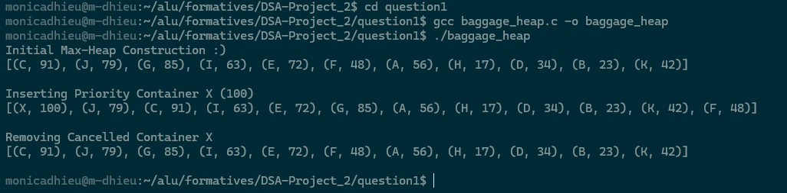
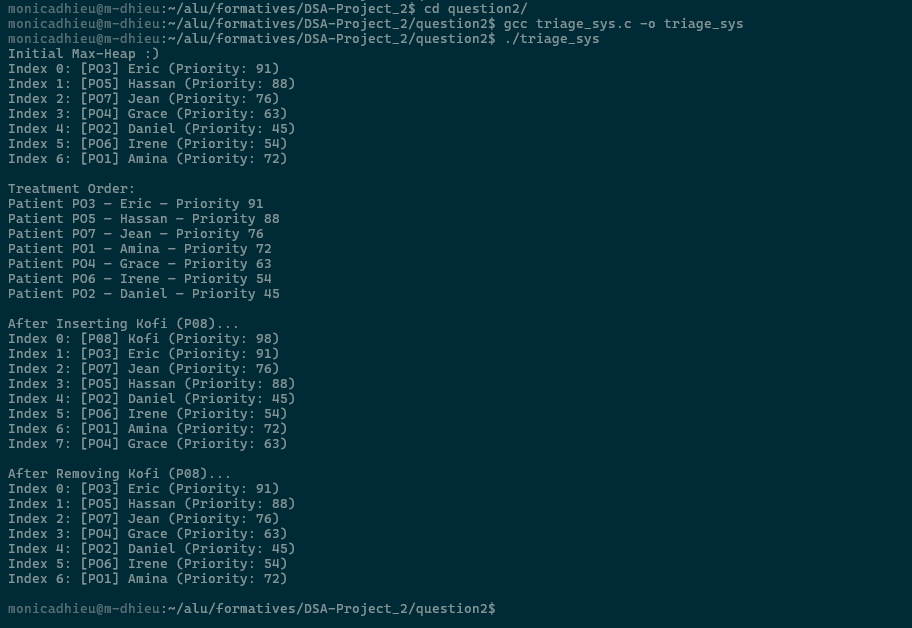
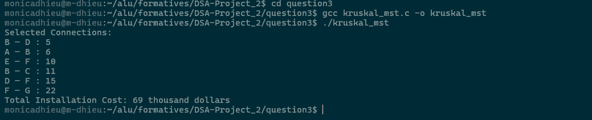
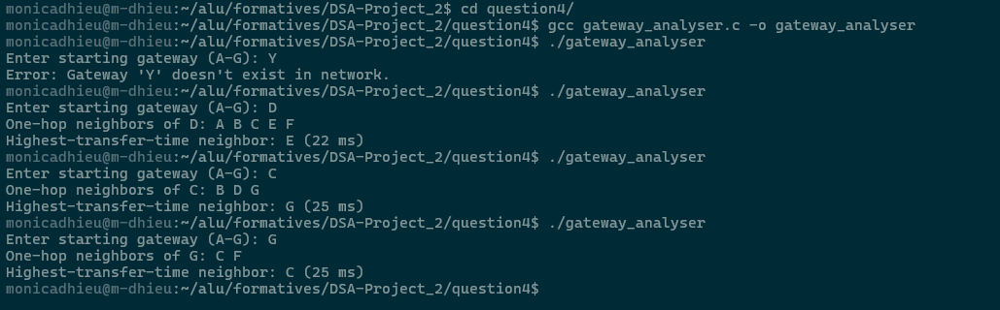
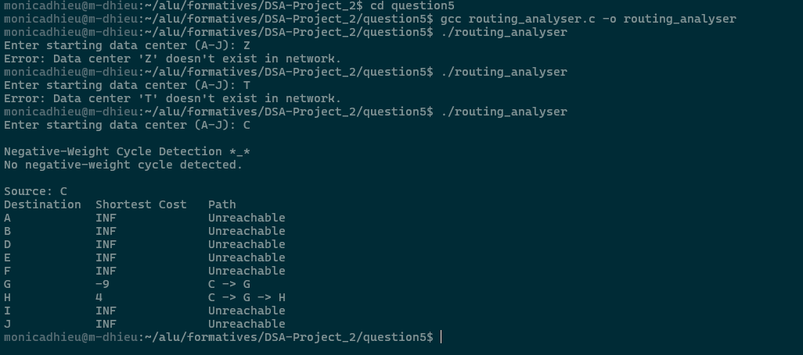

# DSA: Priority Queues & Graph Networks

These projects(questions) cover Heap Priority Queues, Minimum Spanning Trees (MST), Breadth-First Search (BFS) Connectivity Networks, and Bellman-Ford Shortest Path Routing.

---

## Repository Structure

```
.
├── LICENSE
├── .gitignore
├── README.md				# documentation
├── question1/                          # Airport Baggage Priority Queue
├── question2/                          # Hospital Triage Priority System
├── question3/                          # Electric Vehicle Charging Power Net MST
├── question4/                          # IoT Gateway Network BFS
└── question5/                          # Cloud Service Routing Bellman-Ford
```

---

## Compilation & Execution

All applications are written in clean, standard ISO C and can be compiled using any modern C compiler (e.g., `gcc`).

### Question 1: Airport Baggage Max-Heap
```bash
cd question1
gcc baggage_heap.c -o baggage_heap
./baggage_heap
```

### Question 2: Hospital Triage Priority System
```bash
cd question2
gcc triage_sys.c -o triage_sys
./triage_sys
```

### Question 3: EV Charging Power Net MST
```bash
cd question3
gcc kruskal_mst.c -o kruskal_mst
./kruskal_mst
```

### Question 4: IoT Gateway Network BFS Analyser
```bash
cd question4
gcc gateway_analyser.c -o gateway_analyser
./gateway_analyser
```

### Question 5: Cloud Service Routing Analyser
```bash
cd question5
gcc routing_analyser.c -o routing_analyser
./routing_analyser
```

---

## Summary of Algorithms Used

### Question 1: Airport Baggage Handling Priority Queue
* **Objective:** Manage a dynamic airline container queue matching highest priority attributes under \(O(\log N)\) timing boundaries using an array-based Max-Heap.
* **Technique:** Leverages Floyd's bottom-up linear time O(N) heapification algorithm alongside defensive parent/child mapping indices.
* **Detailed Explanation:**
  [Question 1 Explanation](question1/README.md)
* **Execution Verification:**
  

### Question 2: Hospital Emergency Triage Priority System
* **Objective:** Maintain structural string bindings for records containing Patient IDs, names, and health weights, outputting patient treatment ordering smoothly.
* **Technique:** Implements deep memory cloning techniques to execute non-destructive node extraction passes, keeping the target primary queue structure active for follow-up operations.
* **Detailed Explanation:**
  [Question 2 Explanation](question2/README.md)
* **Execution Verification:**
  

### Question 3: EV Charging Station Power Network
* **Objective:** Design a minimum-cost underground cable pipeline network spanning all delivery sectors with no layout routing loop cycles.
* **Technique:** Employs Kruskal's Algorithm backed by an optimized Disjoint Set Union (DSU) tracking structure complete with recursive Path Compression and Union by Rank to achieve tight \(O(E \log E)\) execution metrics.
* **Detailed Explanation:**
  [Question 3 Explanation](question3/README.md)
* **Execution Verification:**
  

### Question 4: IoT Gateway Connectivity Analyser
* **Objective:** Track 1-hop wireless broadcast neighbors from an interactive consumer baseline access point, assessing peak local transfer delays.
* **Technique:** Runs an explicit pointer-managed FIFO Queue configuration driving classic Breadth-First Search (BFS) graph discovery passes.
* **Detailed Explanation:**
  [Question 4 Explanation](question4/README.md)
* **Execution Verification:**
  

### Question 5: Cloud Service Data Routing Analyser
* **Objective:** Uncover minimum cumulative delivery paths between distributed network servers while evaluating hardware performance optimization optimization credits.
* **Technique:** Leverages the Bellman-Ford algorithm operating across V-1 relaxation passes. Includes a V-th verification loop to confidently isolate negative-weight cycles and maps routing layouts through clean column character padding.
* **Detailed Explanation:**
  [Question 5 Explanation](question5/README.md)
* **Execution Verification:**
  

---

## Verification Metrics & Best Practices
* **Defensive Boundary Checks:** All input vectors are strictly guarded against out-of-bounds inputs, invalid characters, or structural stack/array overflow vulnerabilities.
* **Memory Safety:** Heap pointer nodes and disjoint array tracking elements execute zero-leak logic boundaries and release resources (`free()`) safely prior to exit thresholds.
* **Character Compatibility:** Hardcoded paths use standard clean ASCII formatting elements (`->`) to ensure line-by-line script validation compatibility across retro server terminals.

---

## AI Assistance Used

AI tools were used to support:

- Debugging and troubleshooting implementation issues.
- Improving documentation structure and clarity.

---

## Resources

The following resources were used for learning and reference during the development of these projects:

- [Jenny's Bellman Ford Algorithm (YouTube)](https://youtu.be/KudAWAMiQog?si=AqXgMEOdM4cH4hpP)
- [Jenny's Kruskal Algorithm for MST (YouTube)](https://youtu.be/EjVHtpWkIho?si=zXtbeIOs633wa-7J)
- [Abdul Bari DSA (YouTube)](https://www.youtube.com/playlist?list=PLsr8vTgyLdy_YndxNcI4WkH5Vorj5qvrv)
- [GeeksforGeeks Learn DSA in C](https://www.geeksforgeeks.org/c/learn-dsa-in-c/)
- [Opencourseware C Best Practices](https://ocw.mit.edu/courses/6-087-practical-programming-in-c-january-iap-2010/)

---

## License

This project is under the MIT License.

---

## Author

Monica Dhieu

---

*Tuesday, October 06, 2026*

